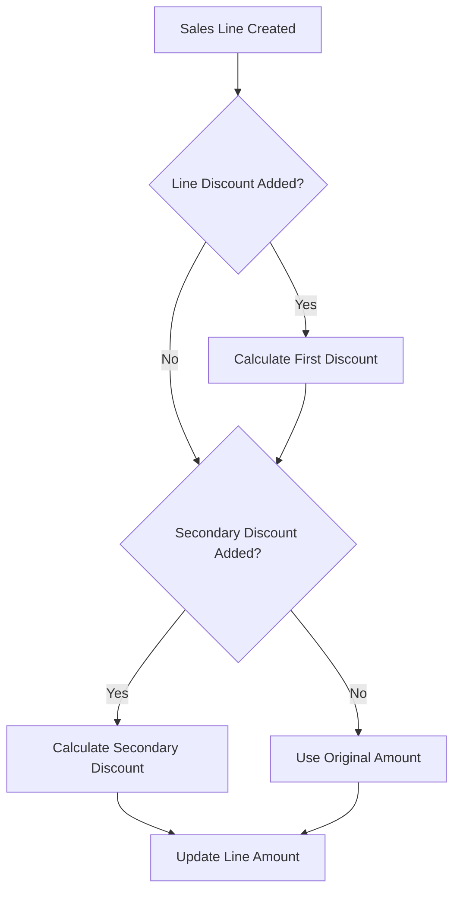
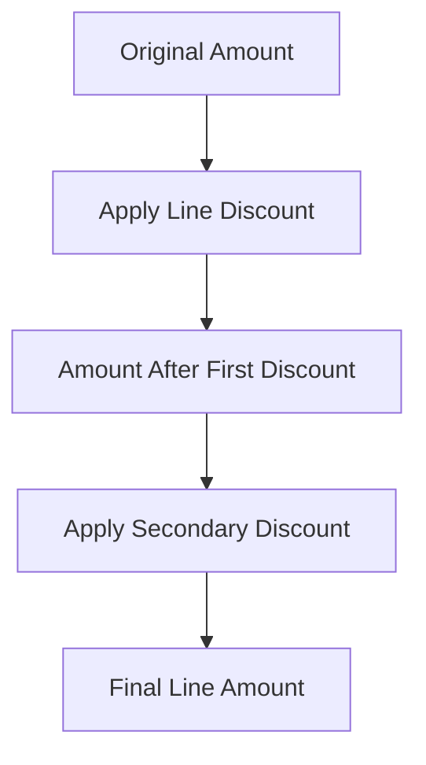

# Double Discount Extension for Business Central

## Overview
This extension adds secondary discount capability to Business Central sales lines, allowing for sequential discount calculations. For example, a 10% line discount followed by a 5% secondary discount.

## Features
- Secondary discount percentage and amount fields on sales lines
- Sequential discount calculation (first discount applied, then secondary)
- Automatic recalculation when quantities or discounts change
- Original amount and first discount amount tracking
- Integration with Sales & Receivables Setup for maximum discount controls

## Process Flow

## Calculation Logic

## Technical Implementation
- Extends Sales Line table with additional fields
- Implements calculation logic in dedicated codeunit
- Uses OnAfterModify trigger to handle line discount changes
- Validates against maximum combined discount if enabled

## Setup
1. Navigate to Sales & Receivables Setup
2. Optional: Set maximum combined discount percentage
3. Optional: Enable maximum discount validation

## Example Calculation
Given:
- Original Amount: 1000
- Line Discount: 10%
- Secondary Discount: 5%

Calculation:
1. First Discount: 1000 * 10% = 100
2. Amount after first: 900
3. Secondary Discount: 900 * 5% = 45
4. Final Amount: 855

## Installation
Standard Business Central extension installation through Visual Studio Code.

## Version History
- 1.0.0 Initial release with base functionality
