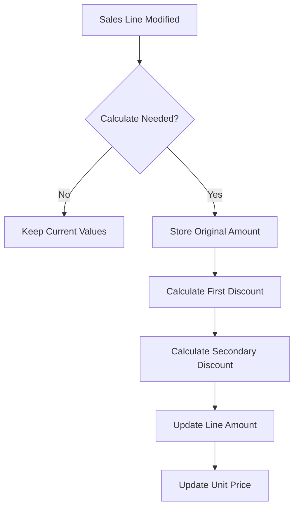
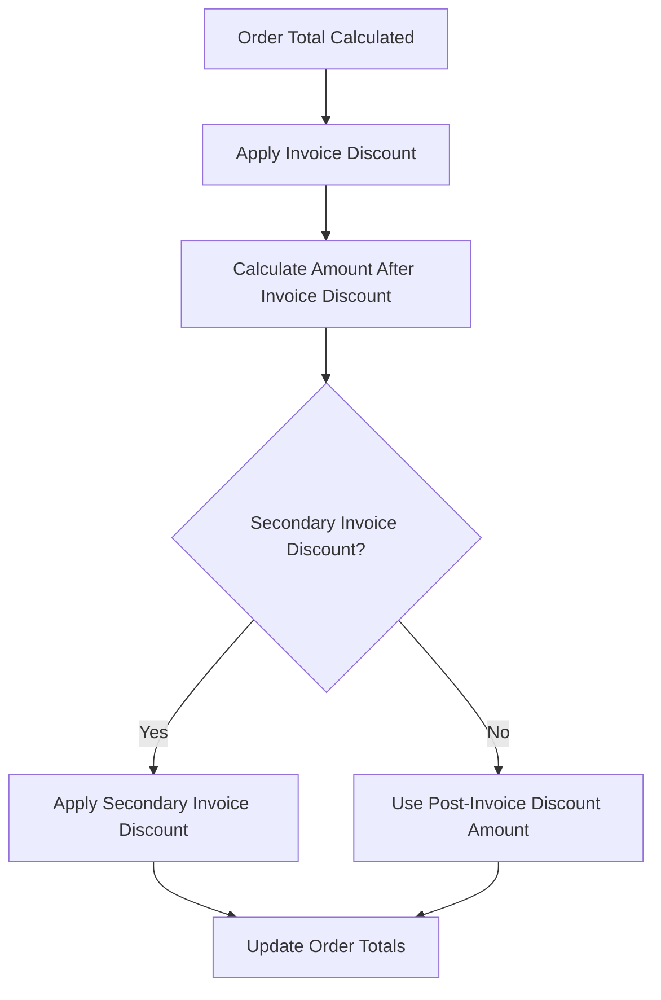

# Double Discount Extension for Business Central

## Overview
This extension adds secondary discount capabilities to Business Central at both the sales line and order level. This allows for sequential discount calculations at two different levels - individual lines can have their own double discount, and the entire order can have an invoice-level double discount applied after the standard invoice discount.

## Features

### Sales Line Double Discounts
- Secondary discount percentage field on sales lines
- Secondary discount amount field (calculated)
- Original amount tracking
- First discount amount tracking
- Sequential discount calculation (first discount applied, then secondary)
- Automatic recalculation when quantities or discounts change
- Reset to original values when discounts are removed

### Order Level Double Discounts
- Secondary invoice discount percentage field on sales header
- Secondary invoice discount amount field (calculated)
- Applies after standard invoice discount
- Updates totals automatically
- Integrates with standard BC document totals

## Process Flows

### Line Level Discounts

### Order Level Discounts

## Calculation Examples

### Line Level Example
Given:
- Original Amount: 20,731.37
- Line Discount: 15%
- Secondary Discount: 10%

Calculation:
1. First Discount Amount: 3,109.71 (15% of 20,731.37)
2. Amount after first discount: 17,621.66
3. Secondary Discount Amount: 1,762.17 (10% of 17,621.66)
4. Final Amount: 15,859.49

### Order Level Example
Given:
- Order Subtotal: 28,653.48
- Invoice Discount: 10%
- Secondary Invoice Discount: 5%

Calculation:
1. Invoice Discount Amount: 2,865.35 (10% of 28,653.48)
2. Amount after invoice discount: 25,788.13
3. Secondary Invoice Discount: 1,289.41 (5% of 25,788.13)
4. Final Order Total: 24,498.72

## Technical Details

### New Fields
Sales Line:
- Secondary Discount %
- Secondary Discount Amount
- Original Amount
- First Discount Amount

Sales Header:
- Secondary Invoice Discount %
- Secondary Invoice Discount Amount

### Implementation
- Clean integration with standard BC pricing/discount framework
- Proper handling of unit price recalculation
- Full support for both discount fields returning to zero
- Maintains data integrity during modifications
- Integration with document totals system

### Page Modifications
- Added fields to Sales Order Subform for line discounts
- Added fields to Sales Order for order-level discounts
- Fields properly positioned in the UI layout
- Clear field tooltips and captions

## Installation
Deploy through standard Business Central extension processes:
1. Install via Visual Studio Code
2. Publish to your Business Central environment
3. Install through Extension Management

## Version History
- 1.0.0: Initial release with comprehensive double discount functionality
  - Line-level double discounts
  - Order-level double discounts
  - Full calculation engine
  - UI integration at both levels
  - Validation and error handling
